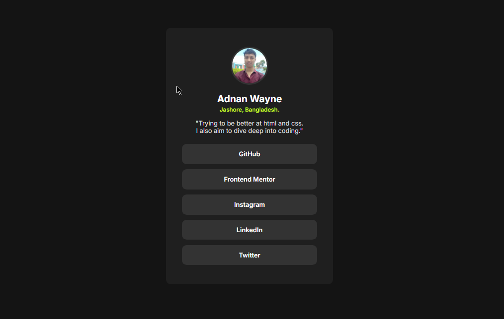

# Social Links Profile

This is my solution to the [Social links profile challenge on Frontend Mentor](https://www.frontendmentor.io/challenges/social-links-profile-UG32l9m6dQ). This project helped me improve my HTML and CSS skills by building a responsive social profile card.

## Overview

- Users can see hover and focus states on all interactive buttons.
- The layout is mobile-first and adapts to desktop screens.
- Colors and fonts follow the Frontend Mentor style guide.

## Screenshot

## Links

- Live site: [https://adnan6901.github.io/social-link-profile/](https://adnan6901.github.io/social-link-profile/)
- Repository: [https://github.com/adnan6901/social-link-profile](https://github.com/adnan6901/social-link-profile)

## Built With

- HTML5  
- CSS3  
- Google Fonts (Inter)
- First design

## What I Learned

- Structuring semantic HTML content  
- Using CSS variables for consistent colors and spacing  
- Creating accessible hover and focus styles  
- Responsive design with media queries

## Author

- Adnan Wayne  
- Frontend Mentor - [@adnan6901] https://www.frontendmentor.io/profile/adnan6901 
- Instagram - [@adnanhasan.jp](https://www.instagram.com/adnanhasan.jp)

---

